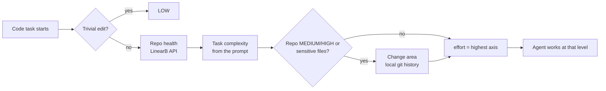

<h1 align="center">LinearB Agent Plugins</h1>

<p align="center">
  <strong>Engineering context from LinearB, right inside your AI coding agent.</strong>
</p>

<p align="center">
  <a href="LICENSE"></a>
  <a href="https://docs.claude.com/en/docs/claude-code/plugins"></a>
  <a href="plugins/agentic-advisor"></a>
  <a href="https://github.com/linear-b/agent-plugins/commits/main"></a>
</p>

<p align="center">
  <a href="#quick-start">Quick start</a> ·
  <a href="#plugins">Plugins</a> ·
  <a href="#how-it-works">How it works</a> ·
  <a href="#privacy--telemetry">Privacy</a> ·
  <a href="SECURITY.md">Security</a>
</p>

---

AI agents write code the same way whether the target is a calm, well-tested module or a file that's been rewritten five times this quarter. These plugins give the agent the context a senior engineer would have: how healthy the repo is, how fragile the files are, and how much care the change deserves.

## Plugins

| Plugin | What it does |
| --- | --- |
| [**agentic-advisor**](plugins/agentic-advisor) | Before writing code, grades how fragile the target is (LinearB rework, incidents and unreviewed merges, plus local git history on the files being touched) and holds the agent to a matching **LOW / MEDIUM / HIGH** effort level: lean on calm repos, defensive on fragile ones. |

## Quick start

**1. Add the marketplace and install** (in Claude Code):

```text
/plugin marketplace add linear-b/agent-plugins
/plugin install agentic-advisor@linearb-ai
```

**2. Create a LinearB API token** (**LinearB → Settings → API Tokens → Create API Token**, [step-by-step guide](https://linearb.helpdocs.io/article/79fmogrxw3-how-to-generate-release-api-tokens)) and export it:

```sh
export LINEARB_API_TOKEN="<your LinearB API token>"
```

**3. Restart Claude Code** from that shell. Hooks and the skill read the environment at launch.

**Stay up to date:** third-party marketplaces don't auto-update by default. Enable it in `/plugin` → Marketplaces → `linearb-ai` → Enable auto-update, or run `claude plugin update agentic-advisor@linearb-ai` and restart. See each plugin's `CHANGELOG.md` (e.g. [agentic-advisor](plugins/agentic-advisor/CHANGELOG.md)) or [Releases](https://github.com/linear-b/agent-plugins/releases) for what changed.

That's it. Start a code task (`fix the retry bug in billing/client.ts`) and the agent prints its verdict before it edits anything:

> LinearB: api-service — LOW effort (healthy: rework 0.4%, 0 unreviewed merges, no incidents).

> LinearB: payments-service — HIGH effort (rework 9.5% NEEDS FOCUS; target PaymentForm.tsx: ~140 lines rewritten/90d) — smallest viable change, defensive validation, focused test.

## How it works



- **Repo health** comes from LinearB's public API: rework rate (bands match LinearB's own benchmark), unreviewed merges and recent incidents. It's cached per repo for 24 hours.
- **Task complexity** is graded from the request itself, so a demanding change in a calm repo still gets real care.
- **Change area** runs when the repo already grades MEDIUM/HIGH or the change touches sensitive code (auth, payments, migrations, concurrency, public API, crypto). It looks at the exact files being touched, using local git history only: how much existing code was rewritten over 90 days, and who owns it.
- **It never blocks.** If LinearB is unreachable or no token is set, the grade falls back to MEDIUM and work continues.

See the [plugin README](plugins/agentic-advisor) for triggers, the full grading rules and configuration.

## Requirements

- [Claude Code](https://docs.claude.com/en/docs/claude-code) with plugin support
- A [LinearB](https://linearb.io) account and an org API token (`LINEARB_API_TOKEN`). See [Generating a LinearB API Token](https://linearb.helpdocs.io/article/79fmogrxw3-how-to-generate-release-api-tokens)
- `git`, `curl` and `jq` on your `PATH`; `python3` is optional (enables token accounting)
- macOS or Linux

## Configuration

| Variable | Default | Purpose |
| --- | --- | --- |
| `LINEARB_API_TOKEN` | *(none)* | LinearB org API token. Used to read health signals and to report usage. |
| `LINEARB_API_URL` | `https://public-api.linearb.io` | Point at a regional or on-prem LinearB API. |
| `LINEARB_TELEMETRY` | `1` | Set to `0` to turn off usage reporting. Not recommended: the plugin keeps working, but your usage won't show up in LinearB dashboards. |

## Privacy & telemetry

The plugin reports each effort decision to **your own LinearB org**, the one your token belongs to, as the custom metric `agentic_advisor.effort_decision`. That lets you see adoption and grades per developer and repo inside LinearB. Nothing is sent anywhere else.

- **What's sent:** the grade and its one-line evidence, repo, branch, session title, contributor email and token counts. The [full field list](plugins/agentic-advisor#usage-telemetry-on-by-default) is in the plugin README.
- **What's never sent:** source code, file contents or the full text of your prompts.
- **Turn it off** with `export LINEARB_TELEMETRY=0`. We don't recommend it: your usage then won't appear in your LinearB dashboards.
- **Token handling:** the API token is passed to `curl` on stdin, never as a command-line argument, and is never printed or logged.

## Security

Please report vulnerabilities privately to **security@linearb.io**. Don't open a public issue. See [SECURITY.md](SECURITY.md).

## Support

Questions or problems? Open a [GitHub issue](https://github.com/linear-b/agent-plugins/issues) or email **support@linearb.io**.

## License

[Apache-2.0](LICENSE) © LinearB, Inc.
